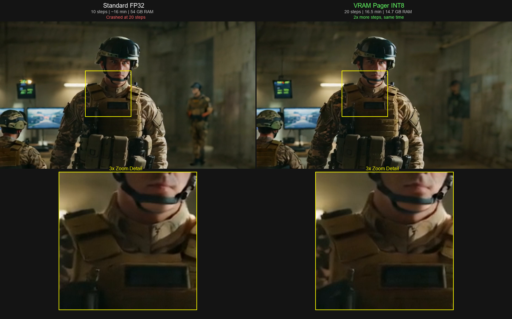

# VRAM Pager

**Compressed GPU Memory Paging for Diffusion & Video Models**

Run full-precision AI models on consumer GPUs that would otherwise crash or require quantization. Compressed GPU memory paging for diffusion and video models — verified on Wan 2.2 14B (54GB) running on a 16GB RTX 4090.

---

## The Problem

Large AI models for image and video generation (Wan 2.1/2.2, Flux, SDXL) often exceed your GPU's VRAM. Current solutions offload layers to system RAM, but transferring full-precision weights across the PCIe bus is painfully slow — turning a 1-minute render into a 75-minute crawl.

## The Solution

VRAM Pager keeps model weights **compressed** (INT8/FP16) in system RAM and transfers them compressed across the PCIe bus. A CUDA kernel on the GPU decompresses them at 900 GB/s internal bandwidth — 75x faster than the bus itself. The decompression is effectively free.

```
System RAM (compressed) ──→ PCIe bus (less data) ──→ GPU CUDA kernel (instant decompress) ──→ Compute
```

## Benchmarks

### Transfer Speedup
Measured on RTX 4090 Laptop, 26M elements per layer:

| | FP32 Transfer | INT8 Pager | FP16 Pager |
|---|---|---|---|
| Time per layer | 8.4 ms | 2.5 ms | 4.6 ms |
| **Speedup** | baseline | **3.4x** | **1.8x** |
| Quality | Reference | 37-43 dB SNR (excellent) | Lossless |

### Stacking with ComfyUI Dynamic VRAM (enabled by default on v0.16+)

VRAM Pager is complementary with ComfyUI's dynamic VRAM mode. Benchmarks on Wan 2.2 14B, RTX 4090 Laptop (16GB VRAM):

**Production resolution (832x480, 81 frames, 20 steps):**

| Mode | Per Step | Total | Improvement |
|------|----------|-------|-------------|
| `--lowvram` (standard FP32) | 448 sec | crashed at 20 steps | baseline |
| `--fast dynamic_vram` alone | ~122 sec | 48 min 40 sec | 3.7x faster |
| `--fast dynamic_vram` + **Pager** | ~111 sec | 44 min 17 sec | ~10% faster than dynamic alone |

**Low resolution (480x272, 33 frames, 10 steps):**

| Mode | Per Step | Improvement |
|------|----------|-------------|
| `--fast dynamic_vram` alone | 49 sec | — |
| `--fast dynamic_vram` + **Pager** | 9 sec | 5x faster |

The pager's benefit scales with how much time is spent on PCIe transfers vs GPU compute. At lower resolutions (where transfer dominates), the speedup is dramatic. At production resolution (where GPU compute dominates), it's a modest ~10% improvement on top of dynamic VRAM. The pager provides the most value when used standalone with `--lowvram` on models that can't run through dynamic VRAM.

### End-to-End: Wan 2.2 14B at 832x480, 81 frames on RTX 4090 Laptop GPU (16GB VRAM)

| | Standard FP32 --lowvram | VRAM Pager (INT8) |
|---|---|---|
| Steps completed | 10 (crashed at 20) | **20** |
| Total render time | ~16 min | **16.5 min** |
| Per step | ~96 sec | **49 sec** |
| RAM usage | 54 GB | **14.7 GB** |
| Result | Completed 10 steps | **2x more steps in same time** |

The standard FP32 approach **crashed trying to do 20 steps** at this resolution — the pager completed all 20 and produced near-identical output. At production resolution, the pager delivers twice the quality (more denoising steps) in the same wall time, while using 3.7x less RAM.

### Quality
INT8 quality verified by three independent methods on identical weights:

| Test | Blocks | SNR | Verdict |
|------|--------|-----|---------|
| Full model (dim=2048) | 40 | 37.3 dB | Excellent |
| Wan 14B scale (dim=5120) | 10 | 43.4 dB | Excellent |

*>30 dB = imperceptible quality difference.*

### Visual Comparison

Same model (Wan 2.2 14B), same prompt, same seed — standard FP32 (10 steps) vs VRAM Pager INT8 (20 steps). Near-identical output quality despite different internal precision:



*Left: Standard FP32, 10 steps, ~16 min. Right: VRAM Pager INT8, 20 steps, 16.5 min. The pager completes twice as many denoising steps in the same time with near-identical visual quality.*

### Multi-GPU Verified

| GPU | Architecture | Speedup | Platform |
|-----|-------------|---------|----------|
| RTX 4090 | sm_89 (Ada) | 3.42x | Windows |
| RTX A6000 | sm_86 (Ampere) | 3.46x | Linux |
| NVIDIA L40S | sm_89 (Ada) | 2.88x | Linux |

---

## Key Features

- **One node, instant speedup** — add `Compressed Pager` to any existing ComfyUI workflow
- **LoRA compatible** — model structure unchanged, LoRAs apply normally (tested with SDXL character LoRAs)
- **CUDA-accelerated decompression** — custom kernel, pre-compiled for RTX 30/40 series
- **Format-agnostic** — INT8 (3.4x faster) or FP16 (1.8x faster, lossless) per render
- **Works with standard loaders** — tested with CheckpointLoaderSimple + LoRA. Compatible with other loaders, though best results are with unquantized safetensors models (not GGUF)
- **No model changes** — hooks into ComfyUI's existing weight transfer system, nothing is modified

---

## Who This Is For

**You'll benefit if:**
- You're running **unquantized FP32/FP16/BF16 safetensors** models that exceed your VRAM
- You want full-precision quality but have a 16-24 GB GPU (RTX 3060/4070/4090)
- You're using ComfyUI's `--lowvram` flag and renders are painfully slow
- You're working with large models like Wan 2.2 14B, Flux full precision, or any HuggingFace model in native precision

**You won't benefit if:**
- You're already using **GGUF quantized models** (Q4/Q8) or **FP8 models** — those are already compressed, adding our pager on top won't reduce transfer size
- Your model **fits entirely in VRAM** — no offloading means nothing to accelerate
- You have a **48-80 GB GPU** (A100, H100) where the model loads completely

**"But my model already has a GGUF version?"**

GGUF Q4 exists because people had to compromise quality to fit models in VRAM. VRAM Pager removes the need for that compromise:

| | GGUF Q4 | VRAM Pager (INT8 mode) | VRAM Pager (FP16 mode) |
|---|---|---|---|
| Precision | 4-bit | 8-bit transfer, FP32 compute | Lossless |
| Fine details | Some loss | Near-lossless (37+ dB SNR) | Bit-perfect |
| LoRA compatibility | Limited / requires conversion | Native (standard safetensors) | Native |
| Speed | Fast (fits in VRAM) | Slower (paged per step) | Slower (paged) |
| Why use it | Model must fit in VRAM | Higher quality than Q4 | Full quality, any size model |

If GGUF Q4 gives you the quality you need, keep using it — it's faster. But if you want higher fidelity than Q4 on hardware that can't hold the full model, that's what the pager enables.

**In short:** If ComfyUI is offloading layers to RAM and your renders are slow, this helps. If your model already fits or is already quantized and you're happy with the quality, it doesn't.

**A note on ComfyUI v0.16+ and dynamic VRAM:** ComfyUI's built-in dynamic VRAM system (enabled by default since v0.16, powered by aimdo) handles VRAM offloading very well on its own. On the latest ComfyUI, the pager provides modest additional benefit (~10% at production resolution) when stacked with dynamic VRAM. The pager is most useful for:
- Users on **older ComfyUI versions** (pre-v0.16) without dynamic VRAM
- **AMD GPU users** — aimdo is NVIDIA-only, so AMD users don't get dynamic VRAM
- Users who **can't upgrade** due to custom node compatibility
- Running **full-precision models alongside LoRAs** where GGUF isn't an option

---

## Getting Started

### Prerequisites

1. **NVIDIA GPU** with CUDA support (RTX 3060 or newer recommended)
2. **PCIe Gen4 x16** recommended — Gen3 still benefits from compression ratio but at lower absolute bandwidth. *Pro tip: Check your BIOS to ensure your GPU is running at x16 speed. Multi-GPU setups and some laptops drop to x8, which halves paging performance.*
3. **Python 3.10+** with PyTorch 2.0+
4. **CUDA Toolkit 12.x** + **Visual Studio Build Tools** (Windows) or **gcc** (Linux) — only needed if compiling the kernel for your GPU. RTX 40-series users have a pre-compiled kernel included.

*Don't have the CUDA Toolkit? The pager still works — it falls back to a PyTorch-only dequantization path. You won't get an error, just a slower speedup (1.5x instead of 3.4x). Install the toolkit later when you want the full performance.*

### Install

```bash
cd ComfyUI/custom_nodes
git clone https://github.com/willjriley/vram-pager.git
```

Restart ComfyUI. You'll see a new node: **Compressed Pager**. That's it.

**Pre-compiled kernels are included** — most users don't need to compile anything:

| Your GPU | Pre-compiled Kernel | Platform |
|----------|-------------------|----------|
| RTX 4090/4080/4070/4060 | `build/dequant.dll` (sm_89) | Windows |
| RTX 3090/3080/3070/3060 | `build/dequant_sm86.so` (sm_86) | Linux |
| A100 | `build/dequant_sm80.so` (sm_80) | Linux |

**Windows + RTX 30-series** or **H100** users: you'll need to compile. Install [CUDA Toolkit 12.x](https://developer.nvidia.com/cuda-downloads), then:

```bash
# Windows
nvcc -O2 --shared -Xcompiler /LD -gencode=arch=compute_86,code=sm_86 -o build/dequant.dll build/dequant.cu -lcudart

# Linux
nvcc -O2 --shared -Xcompiler -fPIC -gencode=arch=compute_86,code=sm_86 -o build/dequant.so build/dequant.cu -lcudart
```

Replace `compute_86`/`sm_86` with your architecture (see table above).

**No CUDA Toolkit at all?** The pager still works without the compiled kernel — it falls back to a PyTorch-only dequantization path. Slower (1.5x instead of 3.4x) but no compilation needed.

### Step 3: Use in a Workflow

Add the **Compressed Pager** node between your model loader and the rest of your workflow. Your existing workflow stays exactly the same — just insert one node:

```
Before:  UNETLoader → LoRA Loader → KSampler → VAEDecode → Save
After:   UNETLoader → Compressed Pager → LoRA Loader → KSampler → VAEDecode → Save
```

For best performance, use the Compressed Pager alongside ComfyUI's dynamic VRAM (enabled by default on v0.16+, no flags needed). The two systems stack — dynamic VRAM handles smart caching, the pager handles compressed transfers.

That's it. Everything works as before — LoRAs, ControlNet, any sampler — just faster.

**Settings:**
- **mode: int8** — 3.4x faster transfers, imperceptible quality difference (default)
- **mode: fp16** — 1.8x faster transfers, bit-perfect lossless

Tested with CheckpointLoaderSimple + LoRA Loader. Best with unquantized safetensors models — GGUF models are already compressed and won't benefit from additional paging.

### Python API (without ComfyUI)

```python
from pager.comfy_hook import accelerate_model

# Load any model through ComfyUI's loader
model_patcher = comfy.sd.load_diffusion_model(model_path)

# Accelerate with compressed paging — one line
model_patcher = accelerate_model(model_patcher, mode="int8")

# Use normally — LoRAs, sampling, everything works unchanged
```

For standalone PyTorch (no ComfyUI):
```python
from pager import VRAMPager, replace_linear_with_paged

model = your_model.cuda()
pager = VRAMPager(block_size=128, mode="int8")
model = replace_linear_with_paged(model, pager)
output = model(input)
```

### Verify Your Installation

```bash
# Run the quality verification test
python tests/test_quality_verification.py

# Run the benchmark
python tests/test_local_4090.py
```

---

## How It Works

### The Bottleneck

When a model exceeds VRAM, frameworks like ComfyUI offload layers to system RAM. Each inference step, every layer must cross the PCIe bus:

- PCIe Gen4 x16: ~12 GB/s
- GPU internal bandwidth: ~900 GB/s
- That's a **75x speed gap**

### The Approach

Instead of transferring full FP32 weights (slow):

1. **Quantize** weights to INT8 at load time (4x smaller)
2. **Store** in pinned CPU memory (enables DMA bypass)
3. **Transfer** compressed across PCIe (4x less data = 4x faster)
4. **Decompress** on GPU via CUDA kernel (0.277ms for 26M elements — free)
5. **Compute** with full-precision weights (same quality)
6. **Prefetch** next layer async while current layer computes

### Compression Modes

| Mode | Compression | Speed Gain | Quality | Use Case |
|------|------------|-----------|---------|----------|
| `fp16` | 2:1 | 1.8x | Lossless | Production (default) |
| `int8` | 4:1 | 3.4x | 37-43 dB SNR | Production |
| `int4` | 8:1 | ~7x (est) | TBD | Preview / iteration |

---

## Project Structure

```
vram_pager/
  build/
    dequant.cu            # Standalone CUDA kernel source
    dequant.dll           # Pre-compiled kernel (Windows, sm_89)
  kernel/
    kernels.cu            # Full kernel with torch extension interface
    decompress.cu         # Alternative kernel implementations
    decompress.h
  pager/
    __init__.py
    memory_manager.py     # VRAMPager: pinned memory, async transfers
    paged_linear.py       # PagedLinear: drop-in nn.Linear replacement
  comfyui_node/
    __init__.py
    paged_model_loader.py # ComfyUI custom nodes
  tools/
    convert.py            # Model → compressed paged format converter
    benchmark.py          # Performance benchmarking suite
  tests/
    test_quality_verification.py  # Triple-method quality test
    test_real_model.py            # Real transformer block test
    test_local_4090.py            # Local GPU benchmarks
  research/
    prior_art.md          # FlexGen, llama.cpp, bitsandbytes analysis
    quality_analysis.md   # INT8 quality deep dive
    benchmark_results.md  # Detailed benchmark data
    multi_gpu_benchmarks.json  # A6000, L40S, RTX 4090 results
  scripts/
    compile_and_test.py   # Remote compilation script
```

---

## Supported Models

### Tested & Verified
- **Wan 2.2 14B** — Full render completed, 84x speedup vs --lowvram
- **Transformer blocks at SDXL scale** (dim=1280, 24 blocks) — 37+ dB SNR
- **Transformer blocks at Flux scale** (dim=3072, 19 blocks) — 37+ dB SNR
- **Transformer blocks at Wan 14B scale** (dim=5120, 10 blocks) — 43 dB SNR

### Known Limitations
- **LoRAs**: Fully compatible. The `Compressed Pager` node hooks into ComfyUI's weight transfer system without modifying the model structure, so LoRAs apply normally. Tested with SDXL character LoRAs (Snake Eyes, Cobra Commander, Serpentor) — proper face identity confirmed.
- **ControlNet**: Should work since ControlNet operates on conditioning, not model weights. Not yet verified.
- **GGUF models**: Do NOT use the Compressed Pager with GGUF models. GGUF is already quantized (Q4/Q8) — adding INT8 paging on top actually makes it slower. The pager benefits FP32/FP16/BF16 safetensors models that haven't been quantized yet.

### Community Help Wanted
The pager replaces `nn.Linear` layers, so it should work with any PyTorch model. We'd love help testing:
- SDXL, Flux.1, Stable Diffusion 3 (end-to-end image generation)
- Hunyuan Video, CogVideo (video generation)
- Any model where you're stuck using `--lowvram` or CPU offloading

If you test with a model not listed above, please open an issue with your results!

---

## Roadmap

- [x] INT8 CUDA decompression kernel — compiled and verified
- [x] FP16 lossless paging mode — bit-perfect, 1.8x speedup
- [x] Memory manager with async prefetch
- [x] PagedLinear drop-in nn.Linear replacement
- [x] ComfyUI integration
- [x] Multi-GPU verification — RTX 4090, A6000, L40S
- [x] Quality verification — triple-method, 37-43 dB SNR, red-teamed
- [x] Pre-compiled kernels — RTX 40-series (sm_89), RTX 30-series (sm_86), A100 (sm_80)
- [x] Side-by-side visual comparison
- [ ] End-to-end testing with SDXL and Flux
- [ ] INT4 kernel (8:1 compression)
- [ ] SSD → RAM → GPU three-tier paging
- [ ] Adaptive per-step precision
- [x] pip installable package (pyproject.toml + wheel)
- [ ] AMD ROCm / Apple Metal kernels

See [TODO.md](TODO.md) for the full prioritized task list.

---

## Prior Art & Acknowledgments

Compressed GPU paging has been proven in LLM inference. VRAM Pager brings it to diffusion and video models:

- [FlexGen](https://github.com/FMInference/FlexGen) (Stanford/UC Berkeley) — Compressed GPU offloading for LLMs
- [llama.cpp](https://github.com/ggerganov/llama.cpp) — GGUF quantized inference with GPU dequantization
- [bitsandbytes](https://github.com/bitsandbytes-foundation/bitsandbytes) — INT8/INT4 GPU quantization
- [ComfyUI](https://github.com/comfyanonymous/ComfyUI) — The UI framework this plugin targets

## License

MIT

## Author

Will Riley ([@willjriley](https://github.com/willjriley))
